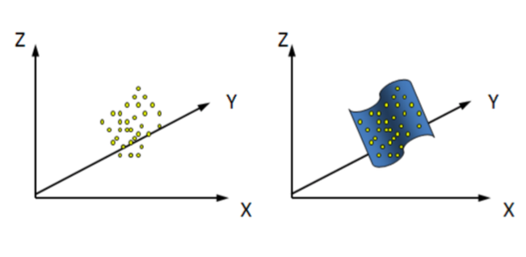
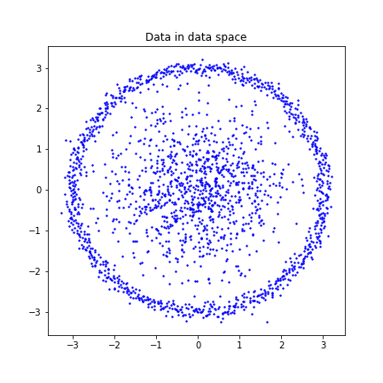
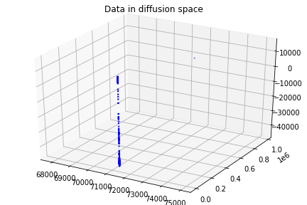
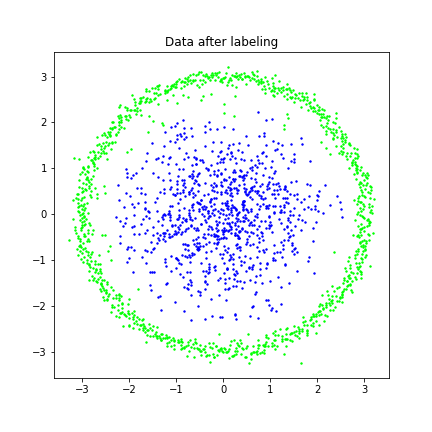
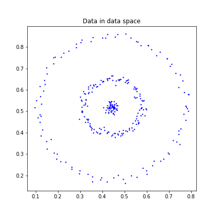
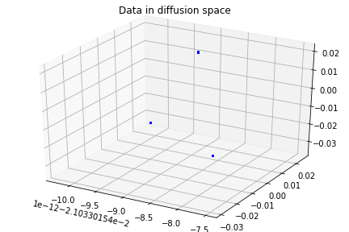
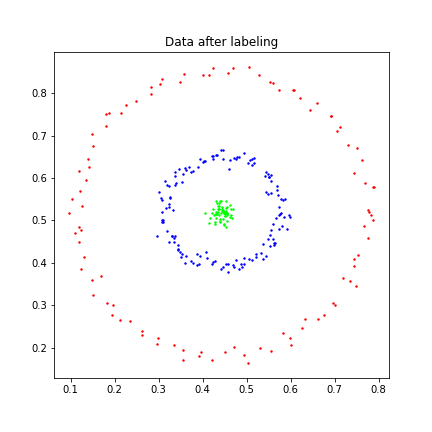
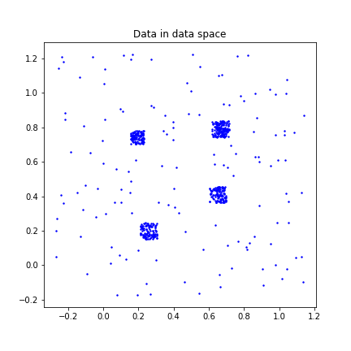
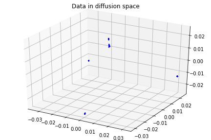
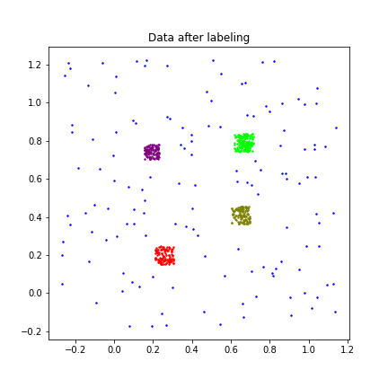

<h1 align="center">Diffusion Maps</h1>

<i>A method for analyzing and organizing high dimensional, noisy, and unordered data.</i>

 

This is an undergraduate summer research project, which investigates the diffusion maps and demonstrates 3 different ways to construct this technique.

## Contents
- [Introduction](#Introduction)
- [Algorithm](#Algorithm)
- [Demonstration](#Demonstration)
- [References](#References)

## Introduction
Assume that a high-dimensional data set lies on a lower-dimensional manifold. Diffusion maps reveals structures of such data set by connecting the geometry of the underlying manifold to the spectral properties of a Markov process on it. 

<em> (image recourse: paper [2]) </em>

### :mag: *Why should we use diffusion maps?*
- rigorous theoretical support
- allow data in data space to have non-linear shape
- robust to noise perturbation 

  
### :mag: *How diffusion maps work?*

***Affinity matrix K***
- K represents a weighted graph on the data set, where edges indicate the affinities between pairwise data points.

***Diffusion matrix P***
- By normalizing rows of K, P represents a random walk on the weighted graph. 
- Let t > 0 be a time parameter, P^t(x,y) (x,y are two data points) represents the probability of jumping from x to y in t steps of a random walk. 

***Diffusion distance of time t***
- Diffusion distance of time t, DD_t(x,y) = || P^t(x,.) - P^t(y,.) ||. 
- DD_t introduces a new relationship between two data points. 
- DD_t is small if there is a large number of short paths connecting x,y.

***Diffusion map of time t, Y_t***
- By using the first k largest eigenvalues and eigenvectors of P^t, Y_t maps data from data space to a k-dimensional Euclidean space. 
- Dimension reduction is done by neglecting certain eigenvalues and their eigenvectors, since the value of an eigenvalue indicates its importance.
- The usual Euclidean distance in the k-dimensional Euclidean space is equal to the diffusion distance in the original data space.  

## Algorithm
There are various ways to construct a diffusion map. Here are the introductions to the three different algorithms in this repository. 

:round_pushpin: Construction 1: `DM-AnnLeeMethod.ipynb`.

- Based on [Ann Lee's Matlab code](https://reurl.cc/E3Ykv), it is my first sight to diffusion maps.  
- Allows one to increase the time parameter t.

    (I found that t = 1 is enough for my data sets to have good embedding results, hence I omitted choosing t in the following constructions.) 

:round_pushpin: Construction 2, `DM-ManorMethod.ipynb`.
- Based on paper [3]. 
- Improves construction 1 by picking a manually selected parameter automatically.

:round_pushpin: Construction 3, `DM.ipynb`.
- Based on paper [1]. 

Steps of these constructions are further stated in the corresponding `.ipynb` files. 

## Demonstration
All three algorithms can effectively cluster data points. This section demonstrates some results using the third construction. 

Note that after obtaining the diffusion map, I clusters data points in the k-dimensional Euclidean space using the KMeans algorithm and obtains a label for each data point. 

:pencil2: `Data.mat`, number of data: 2000, cluster number: 2.

    
    
    

:pencil2: `Data2.mat`, number of data: 299, cluster number: 3.

    
    
    

:pencil2: `Data5.mat`, number of data: 622, cluster number: 5.

    
    
    

See more results in the `results` folder.

## References
[1] Coifman, Ronald R., and Stéphane Lafon. "Diffusion maps." Applied and computational harmonic analysis 21.1 (2006): 5-30.  
[2] De la Porte, J., et al. "An introduction to diffusion maps." Proceedings of the 19th symposium of the pattern recognition association of South Africa (PRASA 2008), Cape Town, South Africa. 2008.  
[3] Zelnik-Manor, Lihi, and Pietro Perona. "Self-tuning spectral clustering." Advances in neural information processing systems 17 (2004). 