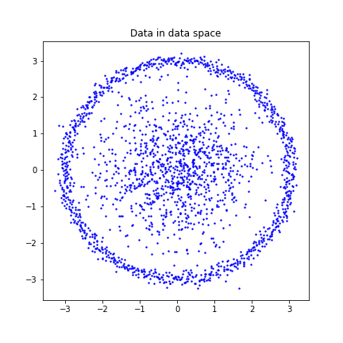
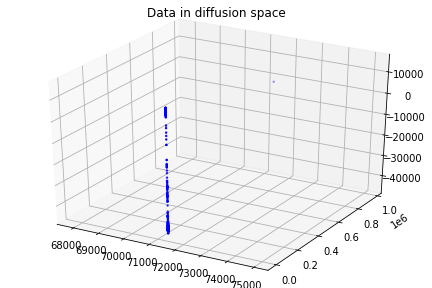
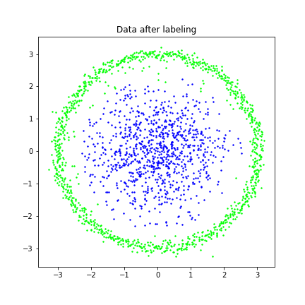
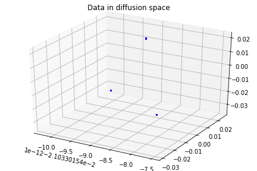
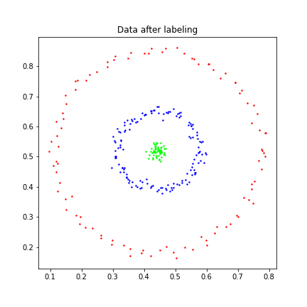
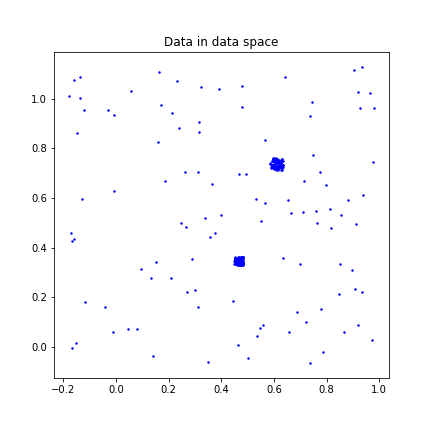
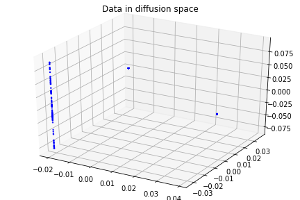
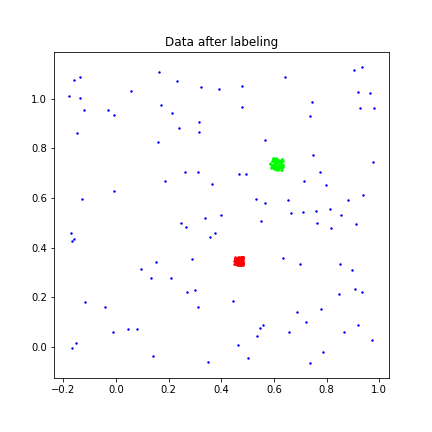
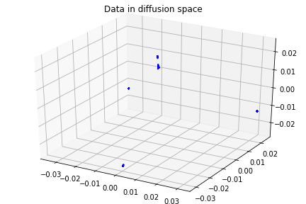
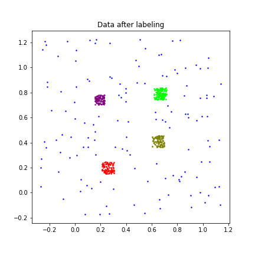

<h1 align="center">Diffusion Maps</h1>

<i>A method for analyzing and organizing high dimensional, noisy, and unordered data.</i>

 

This project introduces the diffusion map and demonstrates 3 different ways to construct this technique.

## Contents
- [Introduction](#Introduction)
- [Implementations](#Implementations)
- [Demonstrations](#Demonstrations)
- [References](#References)

## Introduction
Diffusion maps reveals data structures by finding a lower-dimensional manifold in which points are embedded.

### :mag: *Why should we use diffusion maps?*
- allow data in data space to have non-linear shape
- robust to noise perturbation 
- computationally inexpensive

  
### :mag: *How should we construct diffusion maps?*
There are various way to construct a diffusion map, but the following steps are essential for every construction.

1. ***Construct the affinity (kernel) matrix K*** 
    - The entry of K is small if two data points are far away in the data space, and is large if opposite.

2. ***Construct the diffusion matrix P***
    - P preserves the connectivity between data.  
    - The entry of P is consider as the probability of jumping from one data point to another in one step of a random walk.
    
    Note that by deriving the power of P to *t*, one can stabilize the random walk.  
    This is called the *diffusion process*.  
    Stabilization is benefit from the increase of the probability of following a path along the underlying geometric structure of the data set.  
    (Since data are dense and highly connected along the geometric structure, and pathways form along short and high probability jumps.)

3. ***Construct the diffusion map Y***
    - Y maps data from data space to diffusion space.  
    
    *Dimensional reduction* is done by neglecting certain dimensions in the diffusion space.  
    This is because eigenvalues indicate the importance of each dimension, and the eigenvectors of P form a basis of the diffusion space.

## Implementations
Here are the introductions of three different algorithms I have done.

:round_pushpin: Construction 1, `DM_AnnLeeMethod.ipynb`, is my first sight to diffusion maps.  
- Based on [Ann Lee's Matlab code](https://reurl.cc/E3Ykv).  
- Allows one to increase the time parameter *t* in the diffusion process.  
(I found the process is not necessary for my data set to have good results since they are small, so I omitted this process in the following constructions.) 

:round_pushpin: Construction 2, `DM_ManorMethod.ipynb`, improved version of construction 1.
- Based on the paper [3]. 
- Improved construction 1 by picking a manually selected parameter automatically.

:round_pushpin: Construction 3, `DM.ipynb`, combined knowledges I learned.
- The diffusion map that constructed in my own way. 

## Demonstrations
All algorithms I have done can effectively cluster data.  

I will demonstrate some results in this section. 

:pencil2: `Data.mat`, number of data: 2000.

    
    
    

:pencil2: `Data2.mat`, number of data: 299.

    
    
    

:pencil2: `Data3.mat`, number of data: 303.

    
    
    

:pencil2: `Data5.mat`, number of data: 622.

    
    
    

See more results in the `Results` file.

## References
[1] R.R. Coifman and S. Lafon, Diffusion maps, Applied and computational harmonic analysis, 21(1):5–30, 2006  
[2] J. de la Porte, B. M. Herbst, W. Hereman and S. J. van der Walt., An Introduction to Diffusion Maps, Proceedings of the Nineteenth Annual Symposium of the Pattern Recognition Association of South Africa, 2008  
[3] L. Zelnik-Manor and P. Perona, Self-Tuning Spectral Clustering, Advances in Neural Information Processing Systems 17, pp. 1601-1608, 2005, (NIPS’2004)

