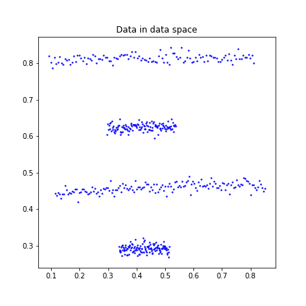
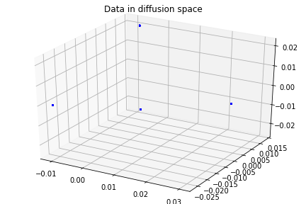
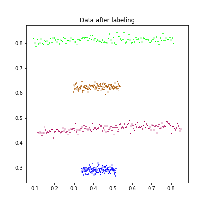

<h1 align="center">Diffusion Maps</h1>
<div align="center"><i>A method for analyzing and organizing high dimensional, noisy, and unordered data.</i></div>
<br>
This project reveals the diffusion map and demonstrates 3 different ways to construct this technique.

## Contents
- [Introduction](#Introduction)
- [Constructions](#Constructions)
- [Demonstrations](#Demonstrations)
- [Conclusion](#Conclusion)
- [References](#References)


## Introduction
Diffusion maps reduced the dimension of data by finding a lower-dimensional manifold in which points are embedded.

### :question: *Why should we use diffusion maps?*
- allow data in data space to have non-linear shape
- robust to noise perturbation 
- computationally inexpensive

  
### :question: *How should we construct diffusion maps?*
There are various way to construct a diffusion map, but the following steps are essential for every construction.

1. ***Construct the affinity (kernel) matrix K*** 
    - The entry of K is small if two data points are far away from each other in the data space, and is large if opposite.


2. ***Construct the diffusion matrix P***
    - P preserves the connectivity between data points.  
    - The entry of P is consider as the probability of jumping from one data point to another in one step of a random walk.
    
    Note that one can stabilize the random walk by deriving the power of P to *t*, this is called the *diffusion process*. Stabilization is benefit from the increase of the probability of following a path along the underlying geometric structure of the data set. (Since data are dense and highly connected along the geometric structure, and pathways form along short and high probability jumps.)


3. ***Construct the diffusion map Y***
    - Y maps corrdinates of data between kernel space and diffusion space.  
    - Dimensional reduction is done by neglecting certain dimensions in the diffusion space. This is because the value of eigenvalues indicate the importance of each dimension, and the left eigenvectors of P form a basis of the diffusion space.


## Constructions
Here are the brief introductions to three different algorithms of constructing diffusion maps I done.

:pencil2: Construction 1, `DM_AnnLeeMethod.ipynb`, is based on [Ann Lee's Matlab code](https://reurl.cc/E3Ykv). This algorithm is my first sight to diffusion maps, it allows one to increase the time parameter $t$ in the diffusion process.  
(I found the process is not necessary for my data set to have good results since they are small, so I omitted this process in the following constructions.) 

:pencil2: Construction 2, `DM_ManorMethod.ipynb`, is based on the paper [3]. This algorithm improves construction 1 by picking a manually selected parameter automatically.

:pencil2: Construction 3, `DM.ipynb`, constructs the diffusion map in my own way. This algorithm combined the knowledge in [1], [2], and [3].


## Demonstrations

All algorithms mention above can effectively cluster data. I will demonstrate some results in this section. 


Results of `Data.mat`:
<p align='center' valign="center">
    
    
    
</p>

Results of `Data2.mat`:


Results of `Data3.mat`:


Results of `Data5.mat`:


Results of `Data6.mat`:



To see more results, please go to the `Results` file.


## Conclusion
This project described the full view of diffusion map, a method of non-linear dimensionality reduction. It showed how to use a kernel function to recover the diffusion matrix and distance, and the relationship between diffusion distance and the diffusion map. It showed that in the lower-dimensional space, the structure of data still be preserved and data can be analyzed more easily.

## References
[1] R.R. Coifman and S. Lafon, Diffusion maps, Applied and computational harmonic analysis, 21(1):5–30, 2006  
[2] J. de la Porte, B. M. Herbst, W. Hereman and S. J. van der Walt., An Introduction to Diffusion Maps, Proceedings of the Nineteenth Annual Symposium of the Pattern Recognition Association of South Africa, 2008  
[3] L. Zelnik-Manor and P. Perona, Self-Tuning Spectral Clustering, Advances in Neural Information Processing Systems 17, pp. 1601-1608, 2005, (NIPS’2004)


```python

```
